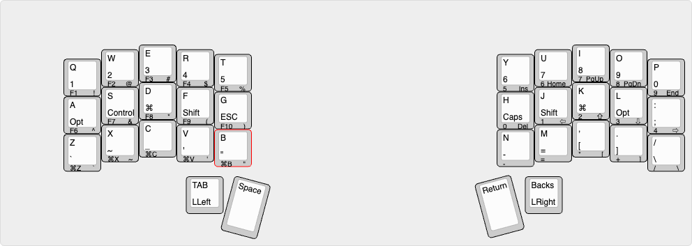

## 음

Boardsouce 의 MicroDox V2 키보드를 사용중이다   
인터넷에 정보는 많지만 어려워서 구현해본 탭댄스 키맵을 남긴다     

 현재 이 키맵으로 잘 쓰고 있고     
Dygma Defy 키보드에도 같은 배열을 적용해서 사용중이다   
(물론 QMK가 아니므로 전용 앱을 사용합니다)   

##키맵 이미지

키캡 한개를 기준으로 설명하자면    
각각   
- Q는 그냥 탭 했을때    
- 1은 키를 홀드했을때   
- F1은 LLeft 레이어를 누른 상태로 눌렀을때   
- !는 LRight 레이어를 누른 상태로 눌렀을때     

동작한다   

## 첨부파일 

[키맵파일](../posts/2024/20240704-tapdance-qmk-attach.c)

## 키맵이미지 만들기 제공 

[키맵이미지](http://www.keyboard-layout-editor.com/#/)

